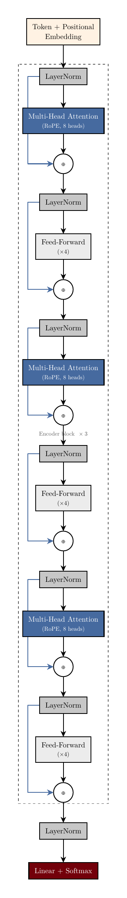
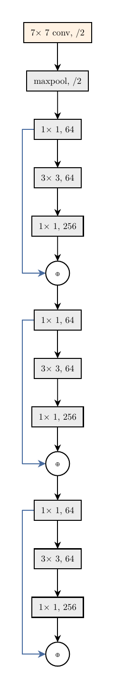
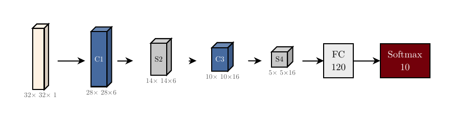
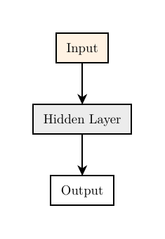

# mlatlas

**Declarative machine-learning, neural-network and AI diagrams for [Typst](https://typst.app).**

Describe the *model* — `transformer(blocks: 6)`, `resnet-stage(blocks: 3)`, a stack of
`conv` feature maps — and get a clean, publication-quality figure in a consistent house
style. You never place a coordinate, name a colour, or tune a stroke unless you want to.

The defaults are opinionated and batteries-included so a simple diagram is one line; every
default is overridable so a power user is never boxed in.

<p align="center">
  
  &nbsp;&nbsp;
  
</p>
<p align="center">
  <br>
  
</p>

*Every figure above is produced from a few lines of `mlatlas`.*

## Design principles

- **Semantic-first.** You declare *what the model is*; the library decides *how it looks*.
- **Sharp & rectangular by default.** Right-angle nodes (`corner-radius: 0pt`), **stealth
  arrowheads only**, **no curved lines anywhere** — straight runs, deterministic gutter
  lanes for skips. Override per node/edge/theme if you really want curves.
- **Batteries included, never a cage.** Sensible defaults for spacing, colour, fonts; drop
  to the raw `graph`/IR layer or hand-tune any primitive whenever you need to.
- **One brand, inherited everywhere.** A single theme (garnet accent, high contrast,
  New Computer Modern) styles every preset. Swap it once to restyle everything.
- **Standalone output.** Each figure compiles to its own `.typ` → `.pdf`, importable into a
  larger document.

## Quick start

```typst
#import "@preview/mlatlas:0.1.0": *   // or a local path: #import "mlatlas/lib.typ": *

// Simple is one line — auto-wired, auto-themed.
#render(seq(
  block(label: [Input], role: "data"),
  block(label: [Hidden Layer]),
  block(label: [Output], role: "io"),
))

// A pre-norm Transformer encoder — residual skips routed automatically.
#render(transformer(blocks: 6, heads: 8, rope: true))

// A CNN as 3-D feature-map prisms.
#render(
  seq(
    conv(label: [C1], spatial: [28#sym.times 28], channels: 6,  role: "attn"),
    conv(label: [S2], spatial: [14#sym.times 14], channels: 6,  role: "norm"),
    conv(label: [C3], spatial: [10#sym.times 10], channels: 16, role: "attn"),
    block(label: [FC], role: "op"),
  ),
  dir: "ltr",
)
```

## Customization — five levels, no forking

```typst
transformer-block(heads: 12)                                  // 1. parameter
block(label: [Conv], style: (fill: blue.lighten(60%)))        // 2. per-node style patch
render(my-ir, theme: theme(spacing: (20mm, 14mm)))            // 3. custom theme
render(my-ir, theme: code-theme)                              // 4. switch the font family
graph(nodes: (...), edges: (...))                             // 5. full escape to raw nodes/edges
```

Fonts follow a deliberate either/or: **New Computer Modern** (formal, the default) or a
**monospace "code" look** via `code-theme` / `theme(font: "DejaVu Sans Mono")`.

## Layout safety net

`render` runs a layout check and **warns when an edge crosses an unrelated block** so you
can fix it (or be alerted):

```typst
#render(my-ir)                 // check: "warn"  (default) — shows a banner if a line crosses a block
#render(my-ir, check: "error") // hard error instead
#render(my-ir, check: "off")   // disable
```

## What's here (Phase 0)

| Layer | Pieces |
|---|---|
| Theme | `garnet-theme` (default), `code-theme`, `theme(..)`, `style-of` |
| IR | `ir-node`, `ir-edge`, `ir-group`, `frag`, `namespace`, `shift` |
| Primitives | `block`, `slab`, `conv`, `op-node` |
| Sugars | `seq`, `graph`, `residual`, `plate` |
| Presets | `transformer`, `transformer-block`, `attention-head`, `resnet-stage` |
| Render | `render`, `standalone`, `check-collisions` |

See [`docs/design-spec.md`](docs/design-spec.md) for the full architecture and the roadmap
toward covering the broader ML-diagram atlas (sequence cells, attention internals,
generative models, graph/probabilistic models, plots, audio/vision/3-D, and the long tail).

## Building the examples

```bash
typst compile --root . examples/transformer-encoder.typ
```

## License

[MIT](LICENSE) © 2026 J.C. Vaught.
