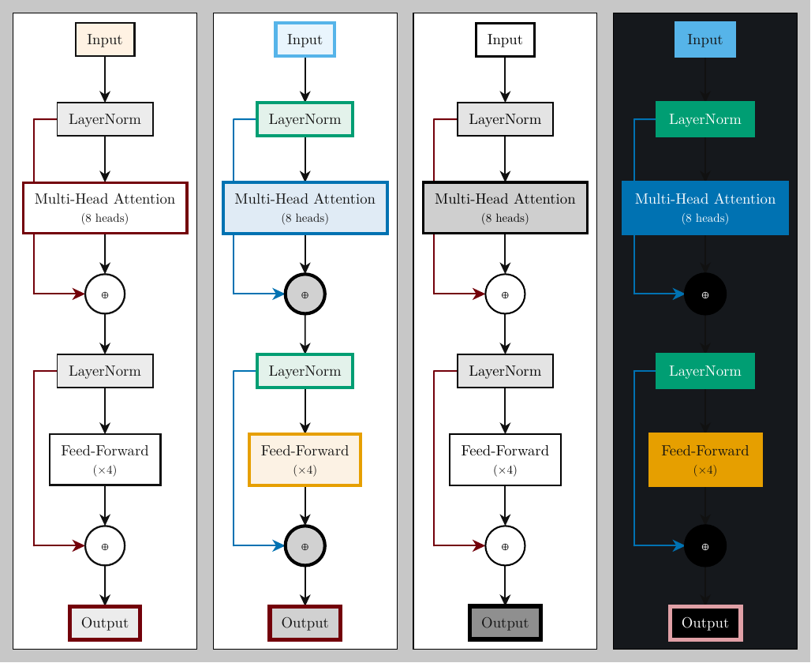
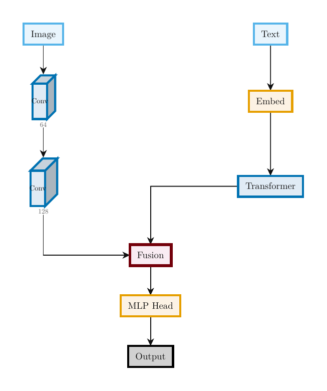
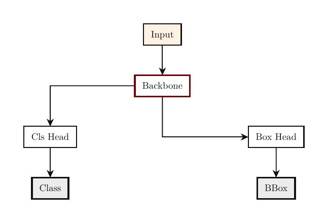
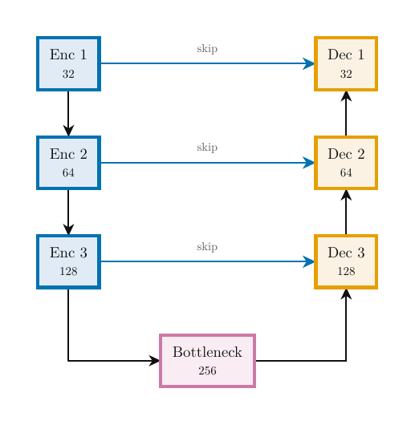

# mlatlas

**Declarative, print-first machine-learning & neural-network diagrams for [Typst](https://typst.app).**

Describe the *model* — `transformer(blocks: 6)`, `mlp((4, 8, 8, 3))`, a two-stream fusion —
and get a clean, publication-quality figure. Batteries-included defaults so a simple diagram
is one line; full control (themes, per-element overrides, custom topologies, raw IR) when you
need it.

<p align="center"></p>

*The same diagram in four themes — one setting flips the whole look.*

## Print-first by design

The default **`mono`** theme is built for paper: **light fills, dark text, sharp orthogonal
edges, stealth arrows**, with garnet used only as a sparse accent. **Never a dark block with
white text.** Switch the entire look with one setting:

```typst
#render(ir)                       // mono (default) — restrained, print-safe
#render(ir, theme: colorful)      // Okabe-Ito light tints (colourblind-safe)
#render(ir, theme: grayscale)     // pure B&W, value + dash differentiation
#render(ir, theme: slides)        // opt-in dark (auto white text)
#render(ir, theme: palette-theme((op: rgb("#1F414D"), norm: rgb("#65780B"))))  // your own scheme
```

A luminance check picks readable text for *any* fill, so contrast is never wrong by accident.

## Quick start

```typst
#import "@preview/mlatlas:0.2.0": *   // or local: #import "mlatlas/lib.typ": *

// Simple is one line — auto-wired, auto-themed.
#render(seq(
  block(label: [Input], role: "data"),
  block(label: [Hidden Layer]),
  block(label: [Output], role: "output"),
))

#render(transformer(blocks: 6, heads: 8, rope: true))   // residual skips auto-routed
#render(mlp((4, 8, 8, 3)))                                // node-edge MLP
#render(lenet(), dir: "ltr")                              // CNN as 3-D feature-map prisms
```

## Custom topologies are first-class

Dual-backbone, two-stream / multi-modal fusion, dual-head — a few readable calls, **no manual
coordinates**:

<p align="center">
  
  &nbsp;&nbsp;
  
  &nbsp;&nbsp;
  
</p>

```typst
// two-stream / multi-modal fusion
#render(two-stream(image-stream, text-stream, fusion: [Fusion], head: head-stack))

// shared backbone, two task heads
#render(branch(backbone, cls-head, box-head))

// arbitrary fan-in / fan-out
#render(merge(arm-a, arm-b, arm-c, into: block(label: [Concat])))
```

## Customization — no forking

```typst
block(label: [Conv], style: (fill: rgb("#eee"), stroke: 2pt + rgb("#65780B")))  // per-node
block(label: [Focal], emphasis: true)                                            // sparse garnet accent
graph(edges: (("a", "b", (style: (stroke: 2pt + red), label: [grad])),))         // per-edge
render(ir, role-map: (attention: "param"))                                       // restyle a category
render(ir, theme: theme(spacing: (18mm, 12mm)))                                  // tweak any theme field
graph(nodes: (..ir-nodes..), edges: (..))                                        // full IR escape hatch
```

## Layout safety net

`render` warns (by default) when an edge crosses an unrelated block — a bbox-aware,
scale-independent check:

```typst
#render(ir)                  // check: "warn"  -> banner if a line crosses a block
#render(ir, check: "error")  // hard error
#render(ir, check: "off")
```

## What's here

| Layer | Pieces |
|---|---|
| Themes | `mono` (default), `colorful`, `colorblind`, `grayscale`/`bw`, `slides`; `theme(..)`, `palette-theme(..)`, `theme-swatch` |
| IR | `ir-node`, `ir-edge`, `frag`, `namespace`, `shift` (escape hatch) |
| Primitives | `block`, `op-node`, `slab`/`conv` (3-D prisms), `neuron-graph` |
| Composition | `seq`, `parallel`, `branch`, `merge`, `concat`, `residual`, `plate`, `graph` |
| Presets | `perceptron`, `mlp`, `feedforward`, `transformer`(`-block`), `attention-head`, `resnet-stage`, `lenet`, `vgg-block`, `unet`, `two-stream` |

Architecture: a plain-dict semantic IR is the contract; primitives/presets emit IR; the
renderer draws it via fletcher/cetz behind an adapter firewall. See
[`docs/design-spec.md`](docs/design-spec.md) for the full design and the roadmap toward the
broader ML-diagram atlas (sequence cells, attention internals, generative/graph/probabilistic
models, plots, audio/3-D, and the long tail).

## Building the examples

```bash
typst compile --root . examples/transformer.typ      # or any example
./tools/render-all.sh                                 # compile + rasterize all
```

## License

[MIT](LICENSE) © 2026 J.C. Vaught.
